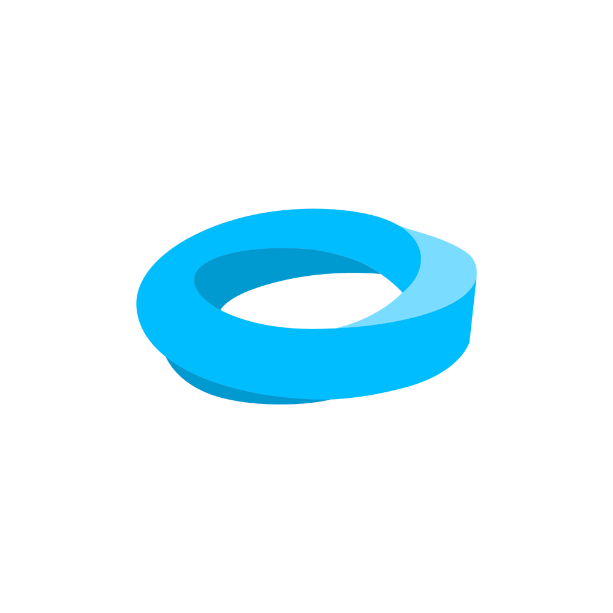

<!-- markdownlint-disable MD033 -->

<h1 align="center">0xSavant's GitHub Profile</h1>

 

●▬▬▬▬▬▬▬▬▬▬▬▬▬▬▬▬▬▬▬ஜ۩۞۩ஜ▬▬▬▬▬▬▬▬▬▬▬▬▬▬▬▬▬▬●

..░░░░░░░░░░░░░░░░░░░░░░░░░░░░░░░░░░░░░░░░░░░░░░░░░░░░░░░░░░..
..░░░░░░░░░░░░░█░█░█░█▀▀▀░█░░░░█▀▀▀░█▀▀█░█▀█▀█░█▀▀▀░░░░░░░░░..
..░░░░░░░░░░░░░█░█░█░█▀▀▀░█░░░░█░░░░█░░█░█░█░█░█▀▀▀░░░░░░░░░..
..░░░░░░░░░░░░░▀▀▀▀▀░▀▀▀▀░▀▀▀▀░▀▀▀▀░▀▀▀▀░▀░▀░▀░▀▀▀▀░░░░░░░░░..
..░░░░░░░░░░░░░░░░░░░░░░░░░░░░░░░░░░░░░░░░░░░░░░░░░░░░░░░░░░..

●▬▬▬▬▬▬▬▬▬▬▬▬▬▬▬▬▬▬▬ஜ۩۞۩ஜ▬▬▬▬▬▬▬▬▬▬▬▬▬▬▬▬▬▬●
  
 
 I'm a Clemson University Student who likes building cool Web3 stuff, especially on Solana. I mostly work with Rust and Typescript, with specialization in agile development practices. 

 
 
 

## &nbsp; **2022 Major Projects**

### :godmode: Mobius Protocol

Mobius Protocol is a Web3-based crowdfunding protocol built for robust funding without barriers. It is the continuation of an earlier project, formerly known as SoFundMe. I was inspired to create this project in January, when the Freedom Convoy in Canada subsequently had their GoFundMe fundraisings taken from them. I'm a firm believer in the natural right of transaction, and a situation like this angered me.

Mobius is focused on creating a funding platform without barriers, harnessing fast and seamless decentralization with Solana. Coming off a prior build, our team decided to hone in on multiple key features like Yield Contribution and Integrated DAO tooling to help propell us to success.

Find out more about the project at our repository:

<https://github.com/0xSavant/MobiusProtocol>

## 🔧 &nbsp;**Current Tech Stack**

